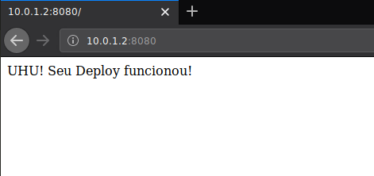

# IIS-Ansible-Deploy

## Proposta

Implantação de uma aplicação .Net Framework:

Nessa questão será explorada a implantação de uma plataforma em modelo de infraestrutura tradicional. Ou seja, a infraestrutura é composta por VMs e as aplicações estão sendo executadas pelo IIS (middleware). Nesse caso, há necessidade de atualizar a mesma plataforma em 10 diferentes clientes ao mesmo tempo. Porém, a infraestrutura é entregue pelos próprios clientes e é necessário automatizar a atualização da plataforma nesse parque de servidores dos clientes.

Sua missão é explicar/demonstrar como poderá ser realizada a automação da implantação/atualização dessa plataforma na infraestrutura dos clientes. Para mostrar sua resolução, é necessário documentar passo-a-passo, também é possível colocar templates de implantação (.yaml ou json) ou imagens para simplificar o entendimento do processo.

## Ferramentas utilizadas na resolução

- [Ansible](https://www.ansible.com/)
- [VirtualBox](https://www.virtualbox.org/wiki/Downloads)
- [Vagrant](https://www.vagrantup.com/)
- package ```pywinrm```, para instalação:

   ```bash
   pip install pywinrm
   ```

obs1: pode ser utilizado outro virtualizador que possua integração com o Vagrant (Hyper-V, VMWare) em substituição ao VirtualBox.

## Passo a passo executado para resolução

### Configuracao do Vagrant

1. Criada uma VagrantBox específica (instruções de criação [aqui](vargrant_box/README.md)) para realizar a simulação das máquinas cliente, a imagem pode ser encontrada aqui [zarthjr/windows10IISAnsible](https://app.vagrantup.com/zarthjr/boxes/windows10IISAnsible/)
1. Criado de arquivo Vagrant ([vagrant/Vagrantfile](vagrant/Vagrantfile)) para simulação da infraestrutura com 10 VM's windows, onde cada VM representa um cliente
   1. O arquivo Vagrant foi montado supondo-se que o site será/está publicado na porta 8080
   1. Foi definida um ip específico para cada VM criada

### Configuracao do Ansible

1. Criado o arquivo de [hosts](ansible/hosts/) e o [ansible.cfg](ansible/ansible.cfg)
1. Criada a role (deploy-iis-site) para criação/atualização do site

## Como rodar este projeto e resultados esperados

1. Entre na pasta [vagrant](vagrant/). Esta pasta contêm o arquivo [Vagrantfile](vagrant/Vagrantfile) que será utilizado na simulação das 10 VM's do cliente.
   1. Caso seja necessário, pode-se diminuir o número de VM's criadas para tornar o processo mais rápido.
      Para reduzir o número de VM's criadas basta alterar o número no loop ```(2..11).each do |i|```
      Este range especificado será o último número do ip das VM's que serão criadas, caso seja alterado este range também deverá ser alterado o arquivo de [hosts](ansible/hosts) do ansible
1. Nesta pasta execute o comando abaixo e aguarde as VM's serem inicializadas (este processo pode ser longo):

    ```bash
    vagrant up
    ```

1. Após a finalização do ```vagrant up``` acesse a pasta [ansible](ansible/). Esta pasta contêm o [playbook.yml](ansible/playbook.yml) e as demais configurações do ansible.
1. Execute o comando abaixo para testar as configurações:

    ```bash
    $ ansible win -i hosts -m win_ping

    10.0.1.2 | SUCCESS => {
      "changed": false,
      "ping": "pong"
    }
    10.0.1.3 | SUCCESS => {
       "changed": false,
       "ping": "pong"
    }
    ```

1. Caso tenha tido sucesso ao exexcutar o ping, executar o comando abaixo para aplicar as configurações (o resultado deve ser similar ao apresentado)

    ```bash
    $ ansible-playbook playbook.yml
  
    PLAY [win] ******************

    TASK [Gathering Facts] ******************
    ok: [10.0.1.2]
    ok: [10.0.1.3]

    TASK [deploy-iis-site : Cria diretório do site] *******************
    ok: [10.0.1.3]
    ok: [10.0.1.2]

    TASK [deploy-iis-site : Cria WebSite] ******************
    ok: [10.0.1.3]
    ok: [10.0.1.2]

    TASK [deploy-iis-site : Abre a porta no firewall] *******************
    ok: [10.0.1.3]
    ok: [10.0.1.2]

    TASK [deploy-iis-site : Deploy do arquivo do site] ******************
    changed: [10.0.1.2]
    changed: [10.0.1.3]

    PLAY RECAP ******************
    10.0.1.2                   : ok=5    changed=1    unreachable=0    failed=0
    10.0.1.3                   : ok=5    changed=1    unreachable=0    failed=0  
    ```
1. Para verificar o resultado basta acessar a url do cliente na porta definida, por exemplo, para o cliente 2: [http://10.0.1.2:8080/](http://10.0.1.2:8080/)

1. O resultado esperado é similar a imagem abaixo:

    
